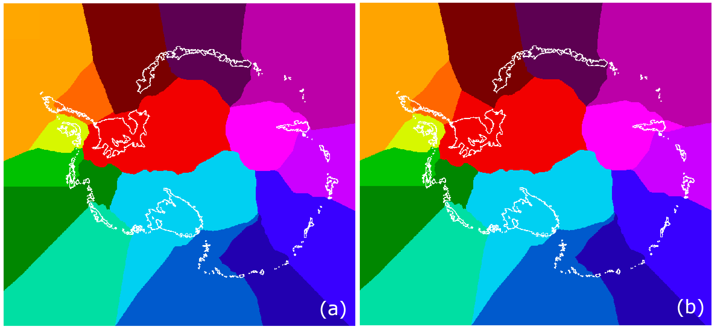

# CMIP6_data_to_ISMIP6_grid

Tools to interpolate and extrapolate CMIP6 ocean data to the ISMIP6 stereographic grid in the PROTECT project.

Tested for: MPI-ESM1-2-HR, IPSL-CM6-LR.

## The scripts and what they do

* **all_files_to_stereo.sh** : calling **all_files_to_stereo.py** to interpolate CMIP6 data to the ISMIP6 stereographic grid (linear triangular interpolation).

* **extrapolate_ALL.sh** :
	- calling **extrapolate_everywhere_horizontally.f90** to fill missing data via (i) horizontal Gaussian extrapolation (sigma=24km) into ice shelf cavities and into ice shelves from contiguous ocean points (not across bathymetry/bedrock), (ii) horizontal Gaussian extrapolation into the IMBIE2-ISMIP6 basins from contiguous ocean points (not across bathymetry/bedrock), (iii) horizontal Gaussian extrapolation over 40km to account for the diversity of bedrocks used by modelling groups but to avoid extrapolation across ridges and the continental shelf, (iv) horizontal Gaussian extrapolation to entirely fill level 2 (Z=-90m) to enable vertical extrapolation everywhere (level 1 is to much affected by summer surface warming).
	- calling **extrapolate_remaining_vertically.f90** to extrapolate downward from above where there are still missing values (e.g., behind ridges, in the bedrock).


## Main differences with the standard ISMIP6 method

The ocean extension of the IMBIE2 basins has been extended further offshore for Filchner-Ronne and Amery (using ```modify_IMBIE2_basins.py```):


